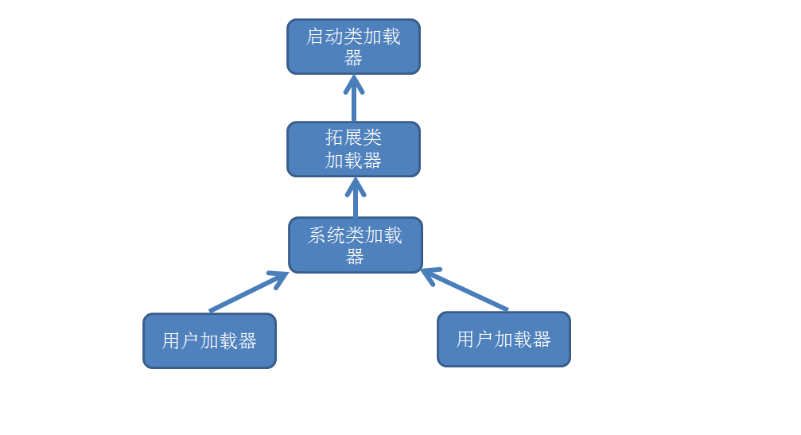

## 一、简介：
- Class类可以获得一个对象所对应的类中的所有信息，如属性，方法，构造器，注解，其父类，实现的接口等。
- Class类的构造器是一个私有的，Class类的实例不能通过new来创建
- 一个类对应一个Class类的实例

## 二、获取Class对象的方式
- 通过class属性获取，该方法最为安全可靠，程序性能高  
``` Class clazz = String.class; ```
- 通过对象的getClass方法  
``` Class clazz = "Hello Java".getClass(); ```
- 通过Class类的forName静态方法（可能抛出ClassNotFoundExceptin异常）  
``` Class.forName("java.lang.String"); ```
  - 全类名：包名+列名，如java.lang.String
  - forName使用的是全类名来获取Class对象的

## 三、 Class类中常用的方法

|方法名|说明|
|----------------------------------|--------------------------------|
|static Class forName(String name) |返回指定类名 name 的 Class 对象|
|Object newInstance() |调用缺省构造函数，返回该Class对象的一个实例|
|Object newInstance(Object []args) |调用当前格式构造函数，返回该Class对象的一个实例|
|getName()|返回此Class对象所表示的实体（类、接口、数组类、基本类型或void）名称|
|Class getSuperClass()|返回当前Class对象的父类的Class对象|
|Class [] getInterfaces()|获取当前Class对象的接口|
|ClassLoader getClassLoader()|返回该类的类加载器|
|Class getSuperclass()|返回表示此Class所表示的实体的超类的Class|

## 四、类加载器
- 定义
  - 负责类加载工作的类
- 种类
  - 启动类加载器（Boostrap ClassLoader）
      - 通常使用C或C++编写
      - 负责Java平台核心库的加载，会搜索sun.boot.class.path中指定位置的类
      - 可以通过System.getProperty("sun.boot.class.path");获取sun.boot.class.path中指定的路径
      - 该类加载器无法直接获取    
  - 拓展类加载器（Extension ClassLoader）
      - 由Java编写
      - 默认加载JRE目录/lib/ext/classes中的.class文件
      - 可以通过System.getProperty("java.ext.dirs");获取java.ext.dirs指定的路径
  - 系统类加载器（System ClassLoader）
      - 也叫应用程序类加载器（Application ClassLoader）
      - 由java编写
      - 负责将classpath或-Djava.class.path所指的目录下的类与jar包装入工作
      - 可以通过System.getProperty("java.class.path");来获取java.class.path指定的路路径
  - 用户自定义加载器（User ClassLoader）
      - 用户自己定义的加载器
   
- 类加载器之间的关系
  - 使用java命令启动JVM时，首先JVM会创建启动类加载器，然后启动类加载器生成拓展类加载器，并将启动类加载器设置为拓展类加载器的父加载器，之后启动类再生成系统类加载器，并将拓展类加载器设置为系统类加载器的父加载器
  - 类加载器的父子关系图（树形结构）

- 双亲委托机制
> 工作过程：如果一个类加载器收到了类加载的请求，它首先不会自己去尝试加载这个类，而是把这个请求委派给父类加载器去完成，每一个层次的加载器都是如此，因此所有的类加载请求都会传给顶层的启动类加载器，只有当父加载器反馈自己无法完成该加载请求（该加载器的搜索范围中没有找到对应的类）时，子加载器才会尝试自己去加载。


